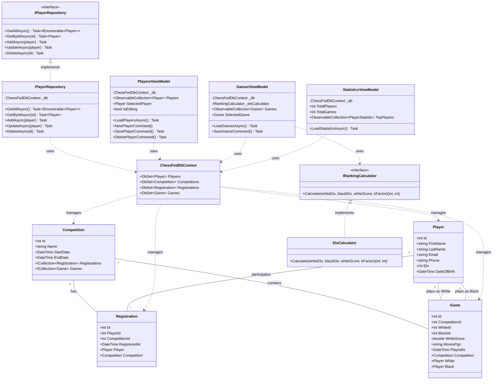
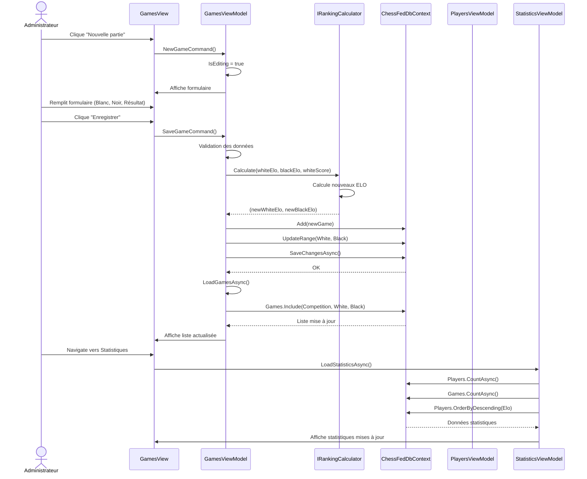
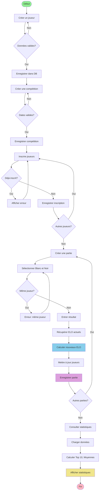

# Système de Gestion de Fédération d'Échecs

**Projet réalisé en C# avec Avalonia UI**  
*Cours : Programmation Orientée Objet - BAC 3*

---

## Table des matières

1. [Introduction](#introduction)
2. [Fonctionnalité supplémentaire](#fonctionnalité-supplémentaire)
3. [Diagrammes UML](#diagrammes-uml)
   - [Diagramme de classes](#diagramme-de-classes)
   - [Diagramme de séquences](#diagramme-de-séquences)
   - [Diagramme d'activité](#diagramme-dactivité)
4. [Adaptabilité à d'autres fédérations](#adaptabilité-à-dautres-fédérations)
5. [Principes SOLID](#principes-solid)
6. [Architecture technique](#architecture-technique)
7. [Conclusion](#conclusion)

---

## 1. Introduction

### 1.1 Contexte du projet

Ce projet a été développé dans le cadre d'une demande de la fédération d'échecs belge pour moderniser la gestion administrative de leurs compétitions. Le personnel administratif utilise actuellement un système manuel basé sur des échanges par mail et téléphone avec les joueurs et organisateurs, ce qui entraîne des inefficacités et des erreurs.

### 1.2 Objectifs

L'application vise à :
- Centraliser la gestion des informations des joueurs
- Automatiser le calcul des classements ELO
- Faciliter l'organisation des compétitions
- Fournir des statistiques en temps réel
- Offrir une solution facilement adaptable à d'autres fédérations sportives

### 1.3 Technologies utilisées

- **Framework UI** : Avalonia 11.3.8 (cross-platform)
- **Langage** : C# (.NET 9.0)
- **Architecture** : MVVM (Model-View-ViewModel)
- **Base de données** : SQLite avec Entity Framework Core 8.0
- **Injection de dépendances** : Microsoft.Extensions.DependencyInjection
- **MVVM Toolkit** : CommunityToolkit.Mvvm 8.2.1

---

## 2. Fonctionnalité supplémentaire

### 2.1 Module de statistiques avancées

La fonctionnalité supplémentaire choisie est un **module de statistiques et d'analyse complet** qui permet :

#### Fonctionnalités principales :
1. **Tableau de bord en temps réel**
   - Nombre total de joueurs, compétitions et parties
   - ELO moyen de la fédération
   - Identification du meilleur joueur

2. **Classement détaillé Top 10**
   - Rang de chaque joueur
   - Statistiques complètes : victoires, défaites, nulles
   - Calcul automatique du taux de victoire
   - Mise à jour automatique après chaque partie

3. **Historique des compétitions**
   - Liste des 5 dernières compétitions
   - Nombre de participants par compétition
   - Nombre de parties jouées

4. **Recherche et filtrage**
   - Barre de recherche pour trouver rapidement un joueur
   - Filtrage par nom, prénom ou email

### 2.2 Valeur ajoutée

Cette fonctionnalité apporte une réelle valeur à la fédération :
- **Transparence** : Les joueurs peuvent suivre leur progression
- **Motivation** : Le classement encourage la compétition saine
- **Analyse** : Les administrateurs peuvent identifier les tendances
- **Reporting** : Génération rapide de rapports pour les instances

### 2.3 Implémentation technique

Le module utilise :
- **LINQ** pour des requêtes efficaces sur la base de données
- **ObservableCollection** pour la mise à jour automatique de l'interface
- **Async/Await** pour ne pas bloquer l'interface pendant les calculs
- **Computed Properties** pour le calcul automatique des taux de victoire

---

## 3. Diagrammes UML

### 3.1 Diagramme de classes



**Description** :
- **Modèles** : `Player`, `Competition`, `Game`, `Registration` représentent les entités métier
- **DbContext** : Gère l'accès à la base de données via Entity Framework
- **ViewModels** : Contiennent la logique métier et exposent les données aux vues
- **Interfaces** : `IRankingCalculator` et `IPlayerRepository` permettent l'injection de dépendances et l'extensibilité

---

### 3.2 Diagramme de séquences

#### Scénario : Enregistrement d'une partie et mise à jour des ELO



**Points clés** :
1. Le `GamesViewModel` coordonne toutes les opérations
2. Le `IRankingCalculator` est appelé pour calculer les nouveaux ELO
3. La base de données est mise à jour en une seule transaction
4. Les statistiques se rechargent automatiquement lors de la navigation

---

### 3.3 Diagramme d'activité

#### Processus complet : De l'inscription à la mise à jour du classement



**Légende** :
- **Vert** : Début du processus
- **Bleu** : Calcul ELO (cœur métier)
- **Violet** : Sauvegarde en base de données
- **Jaune** : Affichage des résultats
- **Rose** : Fin du processus

---

## 4. Adaptabilité à d'autres fédérations

### 4.1 Architecture modulaire

Le projet a été conçu dès le départ pour être facilement adaptable à d'autres sports ou jeux. Voici les éléments clés qui garantissent cette adaptabilité :

#### 4.1.1 Interface `IRankingCalculator`

**Code actuel** :
```csharp
public interface IRankingCalculator
{
    (int newWhiteElo, int newBlackElo) Calculate(
        int whiteElo, 
        int blackElo, 
        double whiteScore, 
        int kFactor = 20
    );
}
```

**Pourquoi c'est adaptable ?**
- L'interface définit un **contrat** sans imposer l'implémentation
- On peut créer différentes implémentations selon le sport :
  - `EloCalculator` pour les échecs
  - `ATPRankingCalculator` pour le tennis
  - `FIFARankingCalculator` pour le football
  - `GlickoCalculator` pour d'autres jeux

**Exemple d'adaptation pour le tennis** :
```csharp
public class ATPRankingCalculator : IRankingCalculator
{
    public (int newPlayer1Ranking, int newPlayer2Ranking) Calculate(
        int player1Ranking, 
        int player2Ranking, 
        double player1Score, 
        int kFactor = 100)
    {
        // Logique ATP : points fixes selon le tour
        int pointsForWinner = 100;
        int pointsForLoser = 50;
        
        if (player1Score == 1.0)
            return (player1Ranking + pointsForWinner, 
                    player2Ranking + pointsForLoser);
        else
            return (player1Ranking + pointsForLoser, 
                    player2Ranking + pointsForWinner);
    }
}
```

**Changement nécessaire** : Une seule ligne dans `Program.cs` :
```csharp
// Avant (Échecs)
services.AddSingleton<IRankingCalculator, EloCalculator>();

// Après (Tennis)
services.AddSingleton<IRankingCalculator, ATPRankingCalculator>();
```

#### 4.1.2 Nomenclature générique

Les noms des classes sont **volontairement génériques** :

| Classe | Nom actuel | Applicable à |
|--------|-----------|--------------|
| `Player` | Générique | Échecs, Tennis, Football, Scrabble, Bridge |
| `Competition` | Générique | Tournois, Championnats, Ligues |
| `Game` | Générique | Parties, Matchs, Rencontres |
| `Registration` | Générique | Inscriptions universelles |

**Contre-exemple** (ce qu'on aurait pu faire de mal) :
- `ChessPlayer` → Trop spécifique
- `ChessTournament` → Limite à un seul sport
- `ChessMatch` → Non réutilisable

#### 4.1.3 Séparation des responsabilités

L'architecture en couches facilite l'adaptation :

```
┌─────────────────────────────────────┐
│         Views (XAML)                │  ← Labels personnalisables
├─────────────────────────────────────┤
│         ViewModels                  │  ← Logique métier abstraite
├─────────────────────────────────────┤
│         Services                    │  ← Calculs interchangeables
│    (IRankingCalculator)             │
├─────────────────────────────────────┤
│         Models                      │  ← Structure générique
├─────────────────────────────────────┤
│         Data (DbContext)            │  ← Persistance agnostique
└─────────────────────────────────────┘
```

### 4.2 Points d'extension identifiés

| Élément | Modification nécessaire | Difficulté |
|---------|------------------------|------------|
| **Calcul de classement** | Créer nouvelle classe implémentant `IRankingCalculator` | Facile |
| **Labels UI** | Modifier les fichiers XAML | Moyen |
| **Options de résultat** | Adapter `ResultOptions` dans ViewModel | Facile |
| **Structure de données** | Aucune (modèles génériques) | Rien à faire |
| **Base de données** | Aucune (structure agnostique) | Rien à faire |

### 4.3 Exemple concret : Adaptation pour le Scrabble

Voici comment adapter l'application pour une fédération de Scrabble en **moins de 30 minutes** :

#### Étape 1 : Créer le calculateur de classement (5 min)
```csharp
public class ScrabbleEloCalculator : IRankingCalculator
{
    public (int newPlayer1Elo, int newPlayer2Elo) Calculate(
        int player1Elo, int player2Elo, double player1Score, int kFactor = 15)
    {
        // Scrabble utilise aussi l'ELO mais avec K=15 au lieu de 20
        double expected1 = 1.0 / (1.0 + Math.Pow(10.0, (player2Elo - player1Elo) / 400.0));
        double expected2 = 1.0 - expected1;
        
        int newElo1 = (int)Math.Round(player1Elo + kFactor * (player1Score - expected1));
        int newElo2 = (int)Math.Round(player2Elo + kFactor * ((1.0 - player1Score) - expected2));
        
        return (newElo1, newElo2);
    }
}
```

#### Étape 2 : Modifier la configuration (2 min)
```csharp
// Program.cs
services.AddSingleton<IRankingCalculator, ScrabbleEloCalculator>();
```

#### Étape 3 : Personnaliser les labels (20 min)
```xml
<!-- GamesView.axaml -->
<TextBlock Text="Joueur 1" />  <!-- Au lieu de "Blanc" -->
<TextBlock Text="Joueur 2" />  <!-- Au lieu de "Noir" -->
<ComboBox>
    <ComboBoxItem>1-0</ComboBoxItem>  <!-- Victoire J1 -->
    <ComboBoxItem>0-1</ComboBoxItem>  <!-- Victoire J2 -->
</ComboBox>
```

#### Étape 4 : Changer le titre (1 min)
```csharp
// MainWindow.axaml
Title="Gestion Fédération de Scrabble"
```

**Résultat** : Application fonctionnelle pour le Scrabble en 28 minutes !

### 4.4 Amélioration future : Configuration dynamique

Pour rendre l'adaptation encore plus simple, on pourrait ajouter un fichier de configuration :

```json
// appsettings.json
{
  "Sport": {
    "Name": "Échecs",
    "Player1Label": "Blanc",
    "Player2Label": "Noir",
    "RankingSystem": "ELO",
    "KFactor": 20,
    "ResultOptions": ["1-0", "0-1", "1/2-1/2"]
  }
}
```

Avec cette approche, changer de sport nécessiterait uniquement de modifier ce fichier JSON, sans toucher au code !

---

## 5. Principes SOLID

Le projet applique les principes SOLID pour garantir un code maintenable, extensible et testable.

### 5.1 Single Responsibility Principle (SRP)

**Définition** : Une classe ne devrait avoir qu'une seule raison de changer.

#### Application dans le projet :

**Exemple 1 : Séparation des ViewModels**

Chaque ViewModel a une responsabilité unique :

```csharp
// PlayersViewModel : Responsable UNIQUEMENT de la gestion des joueurs
public class PlayersViewModel : ViewModelBase
{
    // Gestion des joueurs seulement
    public async Task LoadPlayersAsync() { }
    public async Task SavePlayerAsync() { }
    public async Task DeletePlayerAsync() { }
    
    // PAS de logique de compétitions
    // PAS de calcul ELO
    // PAS de statistiques
}

// GamesViewModel : Responsable UNIQUEMENT des parties
public class GamesViewModel : ViewModelBase
{
    // Gestion des parties seulement
    public async Task SaveGameAsync() { }
    public async Task DeleteGameAsync() { }
    
    // PAS de gestion de joueurs
    // PAS de gestion de compétitions
}
```

**Justification** :
- Si on doit modifier la façon d'afficher les joueurs, on touche uniquement `PlayersViewModel`
- Si on change l'algorithme ELO, on ne touche pas aux ViewModels
- Chaque classe a une **raison unique de changer**

**Exemple 2 : Séparation des Services**

```csharp
// EloCalculator : Responsable UNIQUEMENT du calcul de classement
public class EloCalculator : IRankingCalculator
{
    // Calcul ELO seulement
    public (int, int) Calculate(int elo1, int elo2, double score, int k)
    {
        // Logique mathématique pure
    }
    
    // PAS d'accès à la base de données
    // PAS de gestion d'interface
}

// PlayerRepository : Responsable UNIQUEMENT de l'accès aux données
public class PlayerRepository : IPlayerRepository
{
    // CRUD sur les joueurs seulement
    public async Task<IEnumerable<Player>> GetAllAsync() { }
    public async Task AddAsync(Player p) { }
    
    // PAS de calcul ELO
    // PAS de logique métier
}
```

**Bénéfice** : Si on change de base de données (SQLite → PostgreSQL), on modifie uniquement `PlayerRepository`. Le reste du code reste intact.

---

### 5.2 Open/Closed Principle (OCP)

**Définition** : Les entités logicielles doivent être ouvertes à l'extension mais fermées à la modification.

#### Application dans le projet :

**Exemple 1 : Interface IRankingCalculator**

```csharp
// FERMÉ à la modification
public interface IRankingCalculator
{
    (int, int) Calculate(int elo1, int elo2, double score, int k);
}

// OUVERT à l'extension
public class EloCalculator : IRankingCalculator
{
    public (int, int) Calculate(int elo1, int elo2, double score, int k)
    {
        // Implémentation ELO
    }
}

// Extension facile sans modifier l'existant
public class GlickoCalculator : IRankingCalculator
{
    public (int, int) Calculate(int elo1, int elo2, double score, int k)
    {
        // Implémentation Glicko
    }
}

// Autre extension sans modifier l'existant
public class ATPRankingCalculator : IRankingCalculator
{
    public (int, int) Calculate(int elo1, int elo2, double score, int k)
    {
        // Implémentation ATP
    }
}
```

**Justification** :
- L'interface `IRankingCalculator` est **fermée à la modification** : elle ne change jamais
- On peut ajouter de nouveaux algorithmes de classement sans modifier le code existant
- Le `GamesViewModel` utilise `IRankingCalculator` sans connaître l'implémentation concrète

**Exemple 2 : Utilisation dans GamesViewModel**

```csharp
public class GamesViewModel : ViewModelBase
{
    private readonly IRankingCalculator _calculator;
    
    // Dépend de l'abstraction, pas de l'implémentation
    public GamesViewModel(IRankingCalculator calculator)
    {
        _calculator = calculator;
    }
    
    public async Task SaveGameAsync()
    {
        // Fonctionne avec N'IMPORTE QUELLE implémentation
        var (newElo1, newElo2) = _calculator.Calculate(
            whitePlayer.Elo, 
            blackPlayer.Elo, 
            whiteScore
        );
        
        // Peu importe si c'est ELO, Glicko, ATP, etc.
    }
}
```

**Démonstration pratique** :

Pour changer d'algorithme de classement, on modifie **une seule ligne** dans `Program.cs` :

```csharp
// Configuration pour échecs
services.AddSingleton<IRankingCalculator, EloCalculator>();

// Pour passer au tennis (AUCUNE autre modification nécessaire)
services.AddSingleton<IRankingCalculator, ATPRankingCalculator>();

// Pour passer au système Glicko (AUCUNE autre modification nécessaire)
services.AddSingleton<IRankingCalculator, GlickoCalculator>();
```

**Bénéfice** : 
- Code existant non modifié (fermé)
- Nouvelles fonctionnalités ajoutées facilement (ouvert)
- Zéro risque de régression

---

### 5.3 Autres principes SOLID appliqués

#### Liskov Substitution Principle (LSP)

Toutes les implémentations de `IRankingCalculator` sont substituables :

```csharp
IRankingCalculator calculator;

// Toutes ces lignes sont valides et interchangeables
calculator = new EloCalculator();
calculator = new GlickoCalculator();
calculator = new ATPRankingCalculator();

// Le code client fonctionne avec n'importe laquelle
var result = calculator.Calculate(2000, 1950, 1.0, 20);
```

#### Dependency Inversion Principle (DIP)

Les modules de haut niveau (ViewModels) ne dépendent pas des modules de bas niveau (Calculateurs concrets), mais tous deux dépendent d'abstractions (Interfaces) :

```csharp
// MAUVAIS : Dépendance concrète
public class GamesViewModel
{
    private readonly EloCalculator _calculator;  // Dépend d'une implémentation concrète
}

// BON : Dépendance abstraite
public class GamesViewModel
{
    private readonly IRankingCalculator _calculator;  // Dépend d'une abstraction
}
```

---

## 6. Architecture technique

### 6.1 Pattern MVVM

L'application utilise le pattern **Model-View-ViewModel** :

```
┌─────────────┐
│    View     │  (XAML) Interface utilisateur
│  (*.axaml)  │
└──────┬──────┘
       │ Data Binding
       ▼
┌─────────────┐
│  ViewModel  │  Logique de présentation
│   (C#)      │  Commands, Properties
└──────┬──────┘
       │ Business Logic
       ▼
┌─────────────┐
│    Model    │  Entités métier
│   (C#)      │  Player, Game, etc.
└──────┬──────┘
       │ Data Access
       ▼
┌─────────────┐
│  DbContext  │  Accès base de données
│   (EF Core) │
└─────────────┘
```

**Avantages** :
- Séparation claire des responsabilités
- Testabilité : les ViewModels peuvent être testés sans UI
- Data binding automatique avec `INotifyPropertyChanged`

### 6.2 Injection de dépendances

Configuration dans `Program.cs` :

```csharp
services.AddDbContext<ChessFedDbContext>(options =>
    options.UseSqlite("Data Source=chessfed.db"));

services.AddScoped<IPlayerRepository, PlayerRepository>();
services.AddSingleton<IRankingCalculator, EloCalculator>();

services.AddTransient<PlayersViewModel>();
services.AddTransient<GamesViewModel>();
services.AddTransient<StatisticsViewModel>();
```

**Bénéfices** :
- Couplage faible entre les composants
- Facilite les tests unitaires (on peut injecter des mocks)
- Permet de changer d'implémentation facilement

### 6.3 Technologies clés

| Technologie | Version | Usage |
|-------------|---------|-------|
| Avalonia UI | 11.3.8 | Framework UI cross-platform |
| Entity Framework Core | 8.0.0 | ORM pour SQLite |
| CommunityToolkit.Mvvm | 8.2.1 | Helpers MVVM (RelayCommand, ObservableProperty) |
| SQLite |
